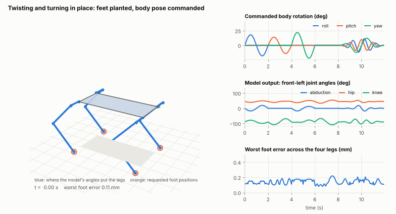
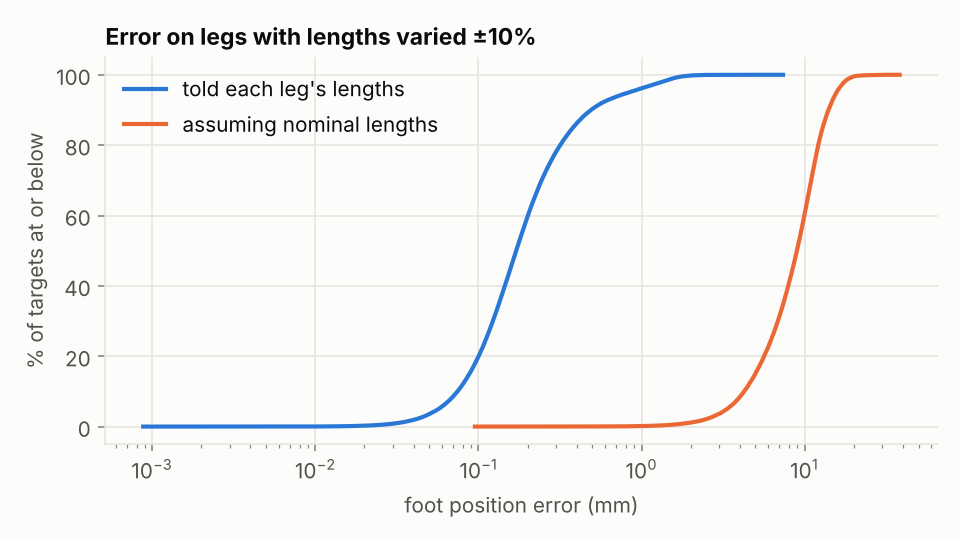
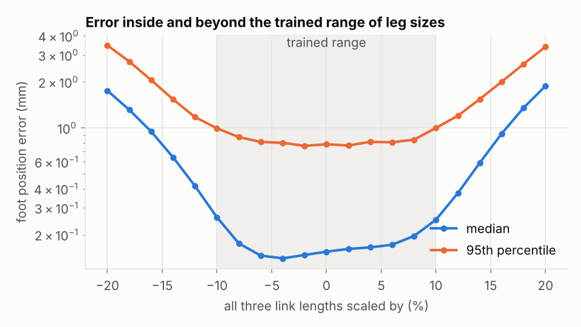
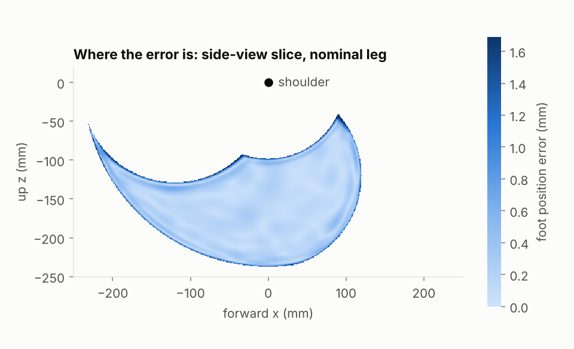
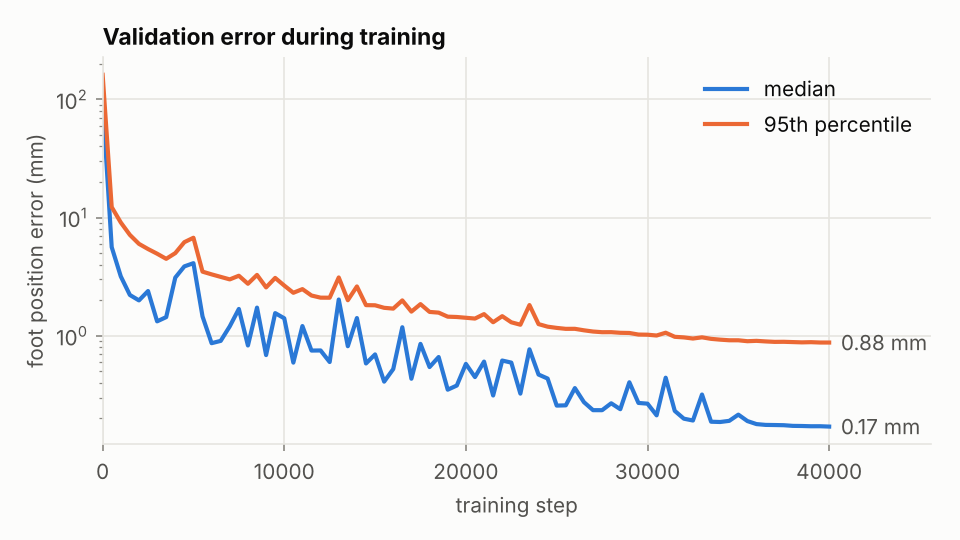
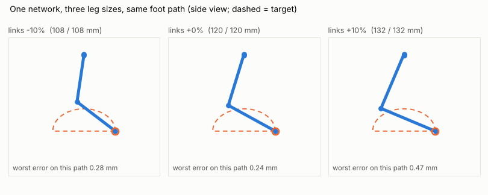
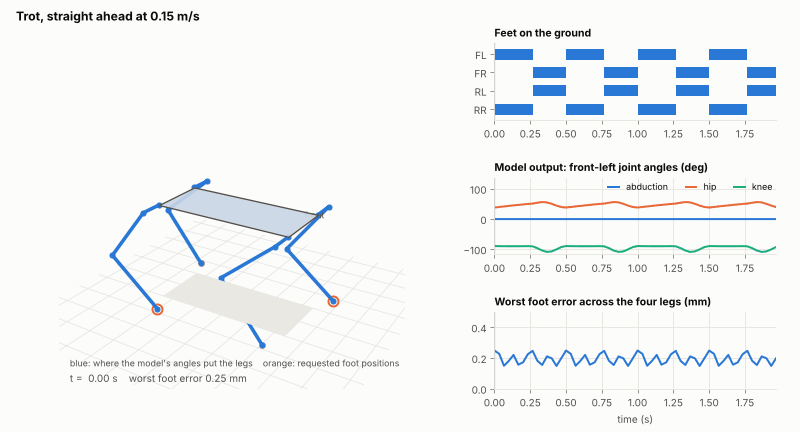
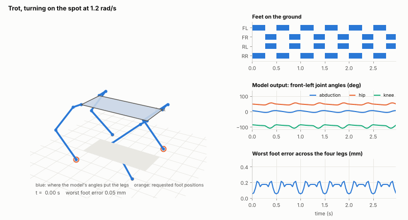
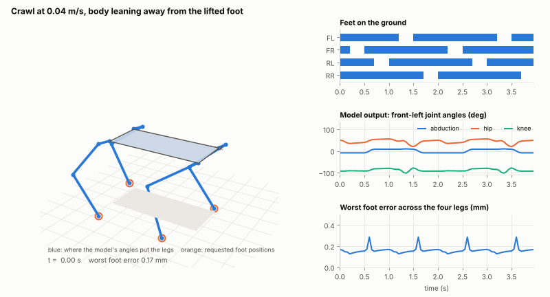

# Mojito


Robots that learn to move in their environment by themselves: a first idea of
the task from simulation, then refinement from real interaction, with return
trips to simulation to prepare for specific tasks.

The first robot is a quadruped with 12 degrees of freedom, 3 per leg:
abduction and hip pitch at the shoulder, and a knee. The feet are grippy pads.



*Every leg in this animation is drawn from the joint angles a trained neural
network produced. The orange rings are where the feet were asked to be.*

## Status

| Stage | What | State |
|---|---|---|
| 0 | One network learns inverse kinematics for a leg, with link lengths as inputs | Done |
| 1 | Whole body: posture control, trot and crawl, NumPy or PyTorch | Done |
| 2 | Physics simulation (MuJoCo) and learned locomotion | Next |
| 3 | The real robot: measurement, calibration, per-leg correction | Planned |
| 4 | The loop: real experience updates the simulator, retrain, redeploy | Planned |

The reasoning behind each stage is in [docs/PLAN.md](docs/PLAN.md).

**Read this before trusting any number below.** Everything so far is geometry.
There is no physics yet, so nothing here says the robot would balance, that
its motors are strong enough, or that its feet would grip. All dimensions and
joint limits are placeholders, not a real robot's:

| Placeholder | Value |
|---|---|
| Abduction offset / upper leg / lower leg | 40 / 120 / 120 mm |
| Shoulder spacing, front to back / side to side | 240 / 100 mm |
| Standing height of the shoulders | 170 mm |
| Joint limits: abduction / hip pitch / knee | ±0.6 / 0 to 1.5 / −2.3 to −0.3 rad |

## Quick start

Python 3.10 or newer. No GPU needed.

```bash
git clone https://github.com/mi897/mojito && cd mojito
pip install -r requirements.txt          # NumPy, SciPy, Matplotlib, Pillow
python -m unittest discover tests        # 34 tests; the 6 PyTorch ones skip if torch is absent
python scripts/make_body_demos.py        # re-render the animations from the trained network
```

The trained network is in the repository (`weights/ik_leg.npz`), so nothing
needs training to try it. Open `docs/demo.html` in a browser to drag a foot
target around and change the link lengths live.

| Script | What it does | Writes |
|---|---|---|
| `scripts/train.py` | Train the leg network (about 12 minutes on 2 CPU cores) | `weights/ik_leg.npz`, `results/training_log.json` |
| `scripts/evaluate.py` | Compare the network with exact IK | `results/metrics.json`, four plots |
| `scripts/calibrate.py` | Adapt to a simulated leg with unknown lengths | `results/calibration.json` |
| `scripts/make_demo.py` | Single-leg demos | `results/step_demo.gif`, `docs/demo.html` |
| `scripts/make_body_demos.py` | Posture, trot and crawl animations (`--no-gif` for numbers only) | four GIFs, `results/body_metrics.json` |

Every script takes `--backend numpy|torch` and `--help`.

## Using it

### One leg

Link lengths are never constants inside the maths. Every function takes them
as an argument, so they can differ per leg and change at any time.

```python
import numpy as np
import mojito
from mojito import leg

net = mojito.load_model("weights/ik_leg.npz")
my_leg = np.array([0.042, 0.115, 0.128])          # abduction offset, upper, lower [m]
target = np.array([0.03, 0.05, -0.18])            # foot position in the shoulder frame [m]

q = net.predict_leg(target, my_leg)               # left leg: abduction, hip pitch, knee [rad]
q_right = net.predict_leg(target, my_leg, right=True)
print(leg.forward(q, my_leg))                     # where those angles put a left foot
print(leg.analytic_ik(target, my_leg))            # the exact answer, for comparison
```

### The whole body

```python
import numpy as np
import mojito
from mojito import body, gaits

robot = body.Robot(mojito.load_model("weights/ik_leg.npz"))   # or body.AnalyticSolver()
home = robot.stance()                                 # feet under the hips, body frame

# Posture: keep the feet where they are, move and tilt the body.
targets = body.apply_posture(home, offset=(0, 0, 0.02), roll=0.2, yaw=0.3)
q = robot.solve(targets)                              # (4, 3) joint angles, legs in FL FR RL RR order
print(robot.tracking_error(targets, q) * 1000)        # mm per foot
print(robot.reachable(targets))                       # inside the joint limits?

# Gait: foot targets for a velocity command.
t = np.linspace(0, 1, 100)
feet, contact, _ = gaits.foot_targets(gaits.TROT, t, home, velocity=(0.15, 0.0), yaw_rate=0.3)
q = robot.solve(feet)                                 # (100, 4, 3)

robot.lengths[0] = [0.041, 0.118, 0.125]              # give one leg different lengths
```

### NumPy or PyTorch

The leg network has two interchangeable backends. **NumPy is the default** and
needs nothing extra. PyTorch is optional (`pip install torch`) and is imported
only when asked for.

| Scope | How |
|---|---|
| One command | `python scripts/train.py --backend torch` |
| Whole shell session | `export MOJITO_BACKEND=torch` |
| The rest of a Python process | `mojito.set_backend("torch")` |
| One call | `mojito.load_model("weights/ik_leg.npz", backend="torch")` |

```python
net = mojito.load_model("weights/ik_leg.npz")                   # NumPy unless told otherwise
net = mojito.load_model("weights/ik_leg.npz", backend="torch")  # same file, PyTorch
new = mojito.make_model(backend="torch", device="cuda")         # untrained, on a GPU
```

- Both backends read and write the same weight files and start from identical
  weights for a given seed.
- `predict` takes and returns NumPy arrays on both, so the body, gait and demo
  code does not care which is active.
- Inside a larger PyTorch model, use `net.angles(p, lengths)` and
  `mojito.torch_model.forward_kinematics(q, lengths)`: tensors in, tensors
  out, differentiable.
- The tests check that the two backends agree on predictions, gradients and
  the path training takes. They run on both backends for every push.

### Training for a different leg

```bash
python scripts/train.py --upper 0.15 --lower 0.14 --abduction 0.05 --tolerance 0.2
```

`--tolerance` is how far each length is varied in training (0.2 means ±20%).
Joint limits live in `JOINT_LIMITS` in `mojito/leg.py`. After retraining,
re-run the other scripts so the results match the new weights.

## Results

All numbers come from the JSON files in `results/`, produced by the scripts
above with the committed weights.

### Stage 0: one leg

Each link length was varied independently by ±10% in training. Tested on
200,000 foot targets and leg sizes the network never saw. The leg reaches
240 mm.

| Foot position error | Median | 95th pct | 99th pct | Worst |
|---|---|---|---|---|
| Network, told each leg's lengths | 0.17 mm | 0.84 mm | 1.57 mm | 7.4 mm |
| Network, assuming every leg is nominal | 9.0 mm | 15.7 mm | 18.8 mm | 38.3 mm |
| Closed-form IK on an ideal leg | exact | exact | exact | exact |

- **The length input is what makes one network cover many legs.** Without it
  the median error is about 50 times larger.
- **Joint angles** are within 0.04° of the exact solution at the median and
  0.53° at the 95th percentile.
- **The worst cases are at the edge of the workspace** (error map below). The
  7.4 mm worst case is real and is about 3% of the leg's reach.
- **Outside the trained range** accuracy falls off smoothly: with all links
  scaled by ±20% the median is 1.8 to 1.9 mm.
- **On an ideal leg the closed-form solution is better.** It is exact and
  about 40 times faster in a batch. The network earns its place only by being
  adaptable, which is the next result.

**Adapting to one specific leg.** `scripts/calibrate.py` simulates a leg whose
true lengths (+6%, −5%, +8%) and servo zero points (2°, −3°, 4°) are unknown.
From 30 foot measurements with 1 mm of noise it estimates all six numbers and
hands the lengths to the same network. Nothing is retrained.

| | Median error | 95th pct |
|---|---|---|
| Before calibration | 16.1 mm | 18.6 mm |
| After calibration | 0.56 mm | 0.74 mm |

| | |
|---|---|
|  |  |
|  |  |



### Stage 1: whole body

One shared network drives all four legs. In each animation the side panels
show the command, the network's output for the front-left leg, and the worst
foot error at that instant.

| Trot, straight | Trot, turning on the spot |
|---|---|
|  |  |

| Crawl, leaning away from the lifted foot |
|---|
|  |

| Demo | Worst foot error | Median | Closest any joint gets to its limit | Feet down |
|---|---|---|---|---|
| Posture: roll ±18°, pitch ±14°, yaw ±22°, height ±30 mm | 0.22 mm | 0.11 mm | 15° | 4 |
| Trot forward, 0.15 m/s | 0.25 mm | 0.14 mm | 23° | 2 |
| Trot turning on the spot, 1.2 rad/s | 0.21 mm | 0.10 mm | 22° | 2 |
| Crawl forward, 0.04 m/s | 0.29 mm | 0.12 mm | 20° | 3 or 4 |

- Every requested foot position in all four demos is inside the joint limits.
  The network's angles differ from the exact solution by at most 0.14°.
- **Grounded feet do not slide.** The gait generator holds each stance foot
  fixed in the world for any mix of forward, sideways and turning speed. The
  tests check this to a nanometre using exact IK.
- **The crawl is statically stable on paper.** The body centre stays at least
  37 mm inside the triangle of grounded feet. This treats the body centre as
  the centre of mass, which is an assumption.

Known weaknesses of these motions:

- The trot has two feet down, so it relies on dynamic balance that geometry
  cannot check.
- The crawl's lean is quick: the body shifts 50 mm in 0.2 s.
- The gaits take a constant velocity command. Changing speed mid-stride is
  not handled yet.

## How it works

**The leg network.** Inputs are the foot target (3 numbers) and the leg's
three link lengths. Outputs are three joint angles, squashed so they always
lie inside the joint limits. It has 3 hidden layers of 128 units, about 34,000
weights.

- **Training data.** Random joint angles are pushed through forward kinematics
  to get foot positions, so every target is reachable. Poses are resampled so
  foot positions cover the workspace more evenly.
- **Loss.** The predicted angles are pushed through forward kinematics and
  compared with the requested foot position. The network is never shown the
  angles that generated the target, so it cannot average two valid poses into
  an invalid one.
- **One answer per target.** The knee bends one way only and stops 0.3 rad
  short of straight.
- **One model for four legs.** A right leg is the mirror image of a left leg:
  flip the target's y on the way in and the abduction angle on the way out.
- **Gradients.** The NumPy backend uses a hand-derived Jacobian, checked
  against finite differences. The PyTorch backend uses autograd.

**The body.** `body.Robot` holds the four shoulder positions and each leg's
lengths. A body pose or gait produces foot targets in the body frame; each is
moved into its leg's shoulder frame and solved by the leg network.

**Gaits.** A foot in stance is held fixed on the ground, so in the body frame
it moves exactly opposite to the commanded body motion. A foot in swing lifts
and travels to where its next stance begins. Trot moves diagonal pairs
together. Crawl lifts one foot at a time and shifts the body away from it
while all four are down.

**Frames and units.** Metres and radians in code. Leg frame: origin at the
shoulder, x forward, y out to the side, z up. Body frame: origin at the centre
of the four shoulders, x forward, y left, z up. Legs are always ordered FL,
FR, RL, RR.

## Repository layout

```
mojito/leg.py          one leg: forward kinematics, Jacobian, closed-form IK, sampling
mojito/model.py        the leg network, NumPy backend; shared base class
mojito/torch_model.py  the leg network, PyTorch backend
mojito/backend.py      backend switch: make_model, load_model, set_backend
mojito/body.py         four legs on a body: frames, posture, per-leg solving
mojito/gaits.py        trot and crawl, crawl lean, stability margin
scripts/               train, evaluate, calibrate, make_demo, make_body_demos
tests/                 unit tests (standard-library unittest)
weights/ik_leg.npz     the trained leg network
results/               metrics (JSON), plots, animations
docs/PLAN.md           roadmap and the reasoning behind it
docs/demo.html         interactive single-leg demo (generated from demo_template.html)
CLAUDE.md              conventions and working rules for AI coding assistants
```

`weights/`, `results/` and `docs/demo.html` are generated by the scripts and
committed so this page renders. Regenerate them rather than editing by hand.

## Working on this

- Work on a branch named for the change; `main` only receives merges.
- Run `python -m unittest discover tests` before committing. GitHub runs the
  same tests, a short training run and the scripts on both backends for every
  push.
- New maths needs a test against something independent: finite differences,
  the closed-form IK, or a property such as "grounded feet do not move".
- Numbers quoted here must come from a run, and must say what was measured.

## Open questions

These decide what Stage 2 and 3 look like.

1. The real link lengths, abduction offset, body dimensions and joint limits.
2. Actuators: hobby servos or torque-controlled motors.
3. How foot or body position will be measured on the real robot. Everything
   learned from real interaction depends on this.
